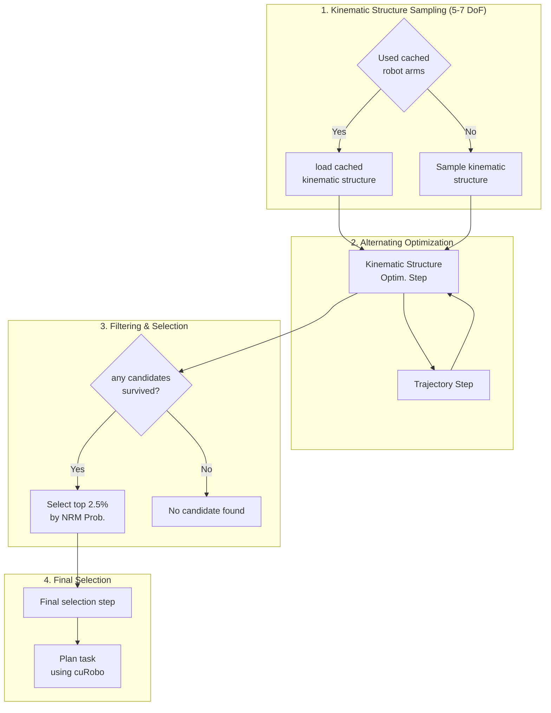

# RAM-Newton

A gradient-based pipeline for robot morphology optimization. Given a target task, it uses [Reachability Across Morphologies (RAM)](https://arxiv.org/abs/2606.09108) to optimize a 6 DOF arm morphology. The result is then validated through collision-free motion planning with [cuRobo](https://github.com/NVlabs/curobo) and visualized in the [Newton physics simulator](https://github.com/newton-physics/newton).

Practical course project at TUM CPS, Summer 2026.

**Team:** Julian Arkenau, Shiyuan Zhang, Jiyao Zhang, Raymond King Setia

**Supervisor:** Tim Walter

## Table of Contents

- [Demo](#demo)
- [Requirements](#requirements)
- [Installation](#installation)
- [Repository Layout](#repository-layout)
- [Usage](#usage)
- [Evaluation](#evaluation)

## Demo


## Requirements

- Python 3.11 or newer
- NVIDIA GPU with CUDA 13.x (both cuRobo and torch use the CUDA 13 build). Verify with `nvidia-smi`.
- [uv](https://docs.astral.sh/uv/getting-started/installation/)

## Installation

Run these steps from the project root.

**1. Install uv** (if you don't have it):

```bash
curl -LsSf https://astral.sh/uv/install.sh | sh
```

See the [uv install docs](https://docs.astral.sh/uv/getting-started/installation/)
for other methods.

**2. Install dependencies.** This creates a virtual environment and installs
everything from `uv.lock`, including the `generative-graphik` baseline:

```bash
uv sync
```

> The `generative-graphik` GGIK baseline is pulled from a
> [fork](https://github.com/jarkenau/generative-graphik) rather than upstream.
> The upstream `revisions` branch does not track the package `__init__.py`
> files, so a git build runs `find_packages()` over a tree with no packages
> and ships an empty wheel. The fork adds them so the build is complete. No
> manual clone is needed, since uv handles it.

**3. Verify the install:**

```bash
uv run python -c "import graphik, liegroups, torch_geometric, generative_graphik.model; print('GGIK deps ok')"
```

## Repository Layout

The library is organized as concept-named packages at the repo root. The
entry-point scripts, evaluations, tests, and data sit alongside them.

```text
paths.py                # canonical PROJECT_ROOT / data / weights / config paths
core/                   # data model: Morphology, Task, Environment, results
kinematics/             # forward kinematics, MDH parameters, self-collision
tasks/                  # task setup
├── environment.py      #   the L-shaped room
└── sampling/           #   morphology + task-pose samplers, candidate cache
methods/                # optimization approaches (see below)
├── nrm_model.py        #   shared NRM surrogate network (MLP)
├── nrm_gradient/       #   gradient-based NRM optimizer (baseline)
├── candidate_selection/  # discrete-alpha candidate search (our heuristic)
├── baselines/          #   direct-IK baselines, not part of the active pipelines
└── legacy/             #   superseded experiments, kept for reference only
planning/               # cuRobo collision-free motion planning
validation/             # reachability/collision validation of a morphology
visualization/          # live viser 3-D rendering, ground plane, d_crit view
logutils/               # optimization CSV logging/reading, timing
pipeline/               # shared entry-point plumbing (common.py)
postprocess/            # figures from logged CSVs

scripts/                # the three pipeline entry points
evaluation/             # seed-sweep harness + its config.json
tests/                  # unit tests
data/                   # weights/ (NRM checkpoints) + initial_candidates/ (cache)
config.json             # default pipeline config
```

The `methods/` folder holds three distinct optimization approaches. Only
`nrm_gradient/` and `candidate_selection/` are wired into the pipelines below.
`baselines/` and `legacy/` are quarantined and have no active callers.

## Usage

There are three pipeline entry points, each pairing a task formulation with an
optimizer:

- `scripts/candidate_selection_static.py` runs the candidate-selection
  heuristic over static task poses (`methods/candidate_selection/static.py`).
- `scripts/candidate_selection_trajectory.py` is **our heuristic**. It extends
  the candidate-selection search to jointly pick a morphology and a trajectory
  (`methods/candidate_selection/trajectory.py`).
- `scripts/gradient_trajectory.py` runs alternating gradient-based optimization
  of morphology and trajectory (`methods/nrm_gradient/trajectory.py`). It serves
  as the baseline to compare the heuristic against.

Run any of them with the default `config.json`:

```bash
uv run python scripts/candidate_selection_static.py
uv run python scripts/candidate_selection_trajectory.py
uv run python scripts/gradient_trajectory.py
```

To supply a different config file:

```bash
uv run python scripts/gradient_trajectory.py --config path/to/my_config.json
```

> **Note:** the `use_cached_optimized_morphology` flag controls whether the
> optimizer runs. When `true`, a run **skips optimization** and replays the most
> recent optimized morphology from `output/`; when `false`, it runs the
> optimizer. See [docs/configuration.md](docs/configuration.md).

## How it works

`main.py` loads a `Task` (a set of goal poses), then either optimizes a
manipulator morphology against a frozen Neural Reachability Map (NRM) checkpoint
or loads a cached one, and finally validates the result with collision-free
motion planning via cuRobo.



## Documentation

Deep reference lives in [`docs/`](docs/) — start at the
[documentation index](docs/index.md):

- [docs/architecture.md](docs/architecture.md) — repository layout, the full
  pipeline, data flow, the paper↔code map, and the output CSV schema.
- [docs/optimization.md](docs/optimization.md) — deep walkthrough of the
  morphology optimizer (differentiable preprocessing, batched optimization,
  early stopping, selection cascade).
- [docs/validation.md](docs/validation.md) — IK/FK validation, cuRobo motion
  planning, and the viser visualization.
- [docs/configuration.md](docs/configuration.md) — every `config.json` key plus
  the hard-coded knobs that live in source.

## Evaluation

`evaluation/run.py` sweeps the pipeline across N random seeds, running each seed
with and without collision avoidance. It writes a crash-safe CSV plus a summary
figure per algorithm to `evaluation_results/`.

The algorithms to run, and the sampler-param tuples to sweep for each, are
defined in [evaluation/config.json](evaluation/config.json) as a flat list
of "algorithms" entries. Each entry is pinned to its own `optim_algo` (one of
`candidate_selection_static`, `candidate_selection_trajectory`, or
`gradient_trajectory`), its sampler-param tuples, and an `output_dir`. The
script always runs every entry in that list, one after another, in a single
invocation:

```bash
uv run python evaluation/run.py
```

Each entry point exposes its own sweepable sampler params.
`candidate_selection_static` has `(num_samples, num_line_samples,
num_extra_paths, repeat_start_goal)`, while the two trajectory algorithms have
just `num_poses`. A preset entry's config tuples must match its `optim_algo`'s
params, and the script raises an error otherwise. To customize the seeds, swept
tuples, or output directories, or to compare the heuristic against the gradient
baseline, edit `evaluation/config.json`. No code changes are needed.

Common options (apply to every algorithm in the list):

```bash
uv run python evaluation/run.py --num-seeds 5            # quick smoke test
uv run python evaluation/run.py --seeds-start 50         # start the seed range at 50
uv run python evaluation/run.py --timeout 1800           # per-run timeout in seconds
uv run python evaluation/run.py --output-dir my_results  # parent dir; each algorithm gets its own <my_results>/<optim_algo> subdir
```

Resume an interrupted sweep by pointing at the existing CSV. Already-completed
`(seed, condition, *sampler_values)` rows are skipped. This only works when
`config.json` has a single algorithm:

```bash
uv run python evaluation/run.py --resume evaluation_results/<optim_algo>/evaluation_<timestamp>.csv
```

Or regenerate the figure for an algorithm's existing CSVs without rerunning:

```bash
uv run python evaluation/run.py --replot
```

Outputs (per algorithm, under its `output_dir`):

- `evaluation_<optim_algo>_<timestamp>.csv` holds one row per `(seed, condition, *sampler_values)`.
- `evaluation_<optim_algo>_<timestamp>.png` shows the outcome breakdown, one subfigure per sampler-param tuple when more than one was swept.
- `configs/` holds the per-run config files.
