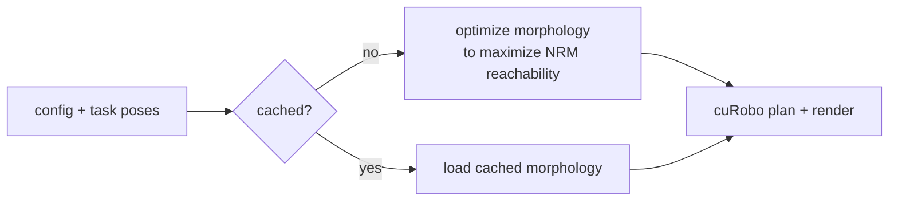

# NRM-Newton

Gradient-based robot morphology optimization pipeline based on Neural Reachability Maps (NRM) and Newton physics simulation. An optimized 6-DOF arm morphology is found for a given task, then validated with collision-free motion planning via cuRobo.

Practical course project — TUM CPS, Summer 2026.

**Team:** Julian Arkenau, Shiyuan Zhang, Jiyao Zhang, Raymond King Setia

**Supervisor**: Tim Walter

---

## Requirements

- Python ≥ 3.11
- NVIDIA GPU with the CUDA 13 toolkit installed and a compatible driver.
  cuRobo is pulled in via the `cu13` extra (`nvidia-curobo[cu13]`) and
  `torch ≥ 2.11` ships its CUDA 13 build, so the GPU and driver must support
  CUDA 13.x. Verify with `nvidia-smi` (CUDA Version ≥ 13.0) and `nvcc --version`.
- [uv](https://docs.astral.sh/uv/getting-started/installation/)

## Installation

Run these steps from the project root.

**1. Install uv** (if you don't have it):

```bash
curl -LsSf https://astral.sh/uv/install.sh | sh
```

See the [uv install docs](https://docs.astral.sh/uv/getting-started/installation/)
for other methods.

**2. Install dependencies.** This creates a virtual environment and installs
everything from `uv.lock`, including the `generative-graphik` baseline:

```bash
uv sync
```

> The `generative-graphik` GGIK baseline is pulled from a
> [fork](https://github.com/jarkenau/generative-graphik) rather than upstream.
> The upstream `revisions` branch doesn't track the package `__init__.py` files,
> so a git build runs `find_packages()` over a tree with no packages and ships
> an empty wheel; the fork adds them so the build is complete. No manual clone
> is needed — uv handles it.

**3. Verify the install:**

```bash
uv run python -c "import graphik, liegroups, torch_geometric, generative_graphik.model; print('GGIK deps ok')"
```

## Usage

Run the full pipeline with the default `config.json`:

```bash
uv run python main.py
```

To supply a different config file:

```bash
uv run python main.py --config path/to/my_config.json
```

> **Note:** the `use_cached_optimized_morphology` flag controls whether the
> optimizer runs. When `true`, a run **skips optimization** and replays the most
> recent optimized morphology from `output/`; when `false`, it runs the
> optimizer. See [docs/configuration.md](docs/configuration.md).

## How it works

`main.py` loads a `Task` (a set of goal poses), then either optimizes a
manipulator morphology against a frozen Neural Reachability Map (NRM) checkpoint
or loads a cached one, and finally validates the result with collision-free
motion planning via cuRobo.



## Documentation

Deep reference lives in [`docs/`](docs/) — start at the
[documentation index](docs/index.md):

- [docs/architecture.md](docs/architecture.md) — repository layout, the full
  pipeline, data flow, the paper↔code map, and the output CSV schema.
- [docs/optimization.md](docs/optimization.md) — deep walkthrough of the
  morphology optimizer (differentiable preprocessing, batched optimization,
  early stopping, selection cascade).
- [docs/validation.md](docs/validation.md) — IK/FK validation, cuRobo motion
  planning, and the viser visualization.
- [docs/configuration.md](docs/configuration.md) — every `config.json` key plus
  the hard-coded knobs that live in source.
- [docs/troubleshooting.md](docs/troubleshooting.md) — common failure points and
  known issues.

