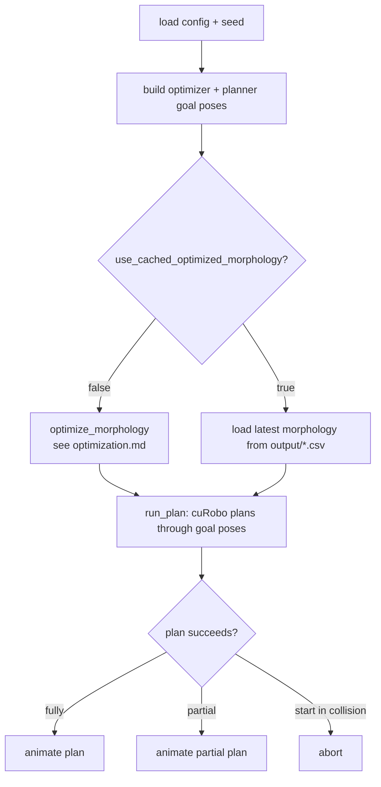

# Architecture

## Repository layout

| Path | Responsibility |
| --- | --- |
| `main.py` | Pipeline entry point: config → task poses → optimize (or load cached) → validate → render. |
| `config.json` | Runtime configuration. See [configuration.md](configuration.md). |
| `interface/` | Shared dataclasses: `Morphology`, `Task`, `Environment`, `PlanResult`, `ValidationResult`. |
| `task/` | Task + morphology generation. `morphology_sampler.py` is the kinematics core (FK, collision, Jacobian, Yoshikawa, rejection sampling); `task_pose_sampler.py` builds goal poses. |
| `optim/` | Optimization. `nrm_alpha_random_selection.py` is the **active optimizer**; `model.py` is the NRM surrogate (LSTM + MLP); `LEGACY/` is unused historical variants. |
| `util/` | Helpers: alpha candidates, distribution checker, cuRobo IK/FK wrappers, MDH transforms, CSV logging. |
| `validation/` | `curobo_planner.py` (motion planning), `optimization_validation.py` (IK/FK), `render.py` (viser). |
| `weights/` | Frozen NRM checkpoint (`checkpoint_5-7.pth`) + `metadata.json`. |
| `output/` | Generated CSV logs and candidate-selection figures (gitignored). |

## Pipeline overview

## Key dataclasses

The data passed between stages (`Morphology`, `Task`, `Environment`,
`PlanResult`, `ValidationResult`) lives in [`interface/`](../interface/) and is
documented inline there.
