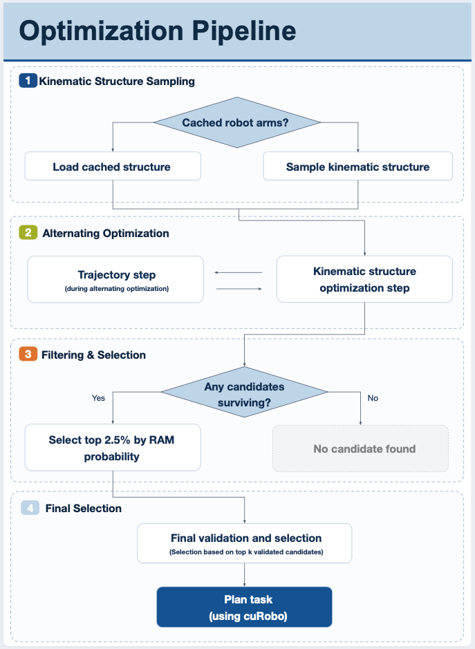

# Architecture

Covers the pipeline stages, the data model passed between them, and the
paper-to-code map.

## Pipeline overview

Each entry point in [`scripts/`](../scripts/) builds a `Task` (an environment
plus a set of goal poses), optimizes a morphology against the frozen RAM
checkpoint (`data/weights/checkpoint_5-7.pth`), then hands the winner to cuRobo
for collision-free motion planning and renders it in viser.

**1. Kinematic structure sampling.** Twist angles are discrete: enumerate alpha
candidates from $\{-\pi/2, 0, \pi/2\}$ per DoF and sample a valid initial morphology
for each. Candidates with three or more consecutive zero-twist links are excluded.

**2. Alternating optimization.** Link lengths `[a, d]` are optimized with AdamW
against the frozen surrogate; twists stay fixed. The trajectory step runs only in
the trajectory pipelines: it holds the morphology fixed and moves intermediate
poses, leaving start and goal pinned. `candidate_selection_static` optimizes the
morphology alone and skips this step.

**3. Filtering and selection.** Survivors go through the distribution checker
(link-validity rejection, collision, Yoshikawa manipulability), then the top
2.5% (`TOP_PROBABILITY_FRACTION`) by RAM probability is kept.

**4. Final selection.** The top candidates are IK/FK validated, ranked by IK pose
success rate with `_tie_score` breaking ties, and the winner is handed to cuRobo.
With `k > 1` (`num_plan_candidates`), each of the top k candidates is tried in
order until one succeeds.

Setting `use_cached_optimized_morphology` skips stages 1–4 entirely and replays
the most recent morphology from `output/`.

## Data model

The dataclasses passed between stages live in [`core/`](../core/) and are
documented inline.

| Type | Contents |
| --- | --- |
| `Morphology` | `params` of shape `[n_links, 3]`, one MDH token `[α, a, d]` per link, plus `link_radius`. `n_links` is DoF + 1 (the end-effector frame also needs a transform). Joint angles are not part of a morphology. |
| `Task` | An `Environment`, `goal_poses` of shape `[n_goals, 4, 4]` visited in order, and an optional `start_q` (defaults to the all-zeros rest pose). |
| `Environment` | A list of static obstacles. |
| `PlanResult` | `success`, the joint-config `path`, and on failure `failed_at_goal` plus the `best_ik_q` reached. |

## Paper ↔ code map

Where each concept lands in the source. Entries are derived from the code and
the [poster](poster/). Entries marked *(inferred)* use terminology from the
paper and should be confirmed against [arXiv:2606.09108](https://arxiv.org/abs/2606.09108).

| Concept | Implementation |
| --- | --- |
| Morphology as a sequence of MDH tokens `[α, a, d]` | [`core/morphology.py`](../core/morphology.py) |
| Discrete twist set $\{-\pi/2, 0, \pi/2\}$ | `ALPHA_VALUES` in [`tasks/sampling/fixed_alpha_candidates.py`](../tasks/sampling/fixed_alpha_candidates.py) |
| Reachability surrogate | `MLP` in [`methods/nrm_model.py`](../methods/nrm_model.py): an LSTM `Encoder` over the link sequence feeding an MLP `Decoder` |
| Reachability probability for a pose | `torch.sigmoid(logit)` over the decoder output, averaged across poses |
| Pose encoding, SE(3) → 9D | `_se3_to_vector` in [`methods/_nrm_common.py`](../methods/_nrm_common.py): 3D position + 6D rotation |
| Length preprocessing (normalize → squash → normalize) | `_preprocess_lengths`, same file |
| Straight-through gradient past the squash | `SquasherSTE`, same file *(inferred)* |
| Frozen checkpoint, gradients to inputs only | `_load_model`, same file — weights get `requires_grad_(False)` |
| Top-2.5% probability cut | `TOP_PROBABILITY_FRACTION` in [`methods/candidate_selection/_common.py`](../methods/candidate_selection/_common.py) |
| Distribution validity check | [`validation/distribution_checker.py`](../validation/distribution_checker.py), using FK, collision, and Yoshikawa manipulability |
| Tie-break heuristic among final candidates | `_tie_score` in [`methods/candidate_selection/_common.py`](../methods/candidate_selection/_common.py) |
| IK/FK validation | [`validation/optimization_validation.py`](../validation/optimization_validation.py) |
| Forward kinematics / MDH transforms | [`kinematics/kinematics.py`](../kinematics/kinematics.py), [`kinematics/mdh.py`](../kinematics/mdh.py) |
| Self-collision via capsule pairs | [`kinematics/self_collision.py`](../kinematics/self_collision.py) |
| Collision-free motion planning | [`planning/curobo_planner.py`](../planning/curobo_planner.py) |
| success@k | `num_plan_candidates`, threaded through [`pipeline/common.py`](../pipeline/common.py) and [`evaluation/run.py`](../evaluation/run.py) |
